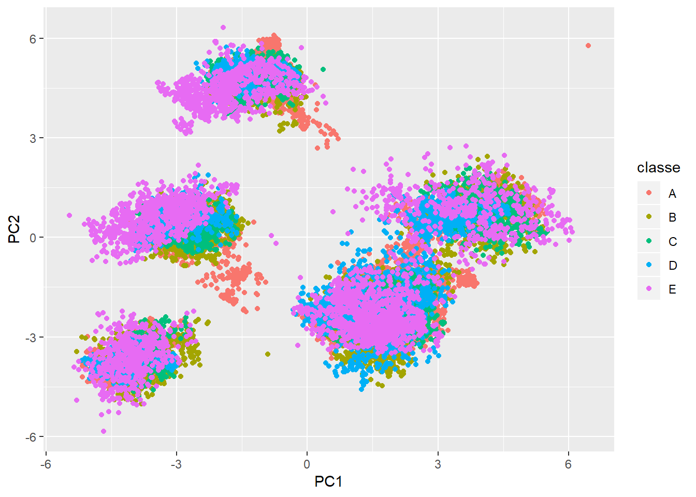

## Executive summary  
Using devices such as Jawbone Up, Nike FuelBand, and Fitbit it is now possible to collect a large amount of data about personal activity relatively inexpensively. These type of devices are part of the quantified self movement - a group of enthusiasts who take measurements about themselves regularly to improve their health, to find patterns in their behavior, or because they are tech geeks. One thing that people regularly do is quantify how much of a particular activity they do, but they rarely quantify how well they do it. In this project, our goal will be to use data from accelerometers on the belt, forearm, arm, and dumbell of 6 participants. They were asked to perform barbell lifts correctly and incorrectly in 5 different ways.  

## Getting data  

```r
library(dplyr)
library(caret)
library(randomForest)
library(rpart)
library(rpart.plot)
library(rattle)
fTrain <- "https://d396qusza40orc.cloudfront.net/predmachlearn/pml-training.csv"
fTest <- "https://d396qusza40orc.cloudfront.net/predmachlearn/pml-testing.csv"

dsTrain <- read.csv2("dsTrain.csv",
                     header=TRUE, sep=",",na.strings = c("NA","",'#DIV/0!'),
                     stringsAsFactors = T,dec = ".")
dsTest <- read.csv2("dsTest.csv",
                    header=TRUE, sep=",",na.strings = c("NA","",'#DIV/0!'),
                    stringsAsFactors = T,dec = ".")
```


The dataset contains quite a number of missing values. Let's get rid of them in the training and the test sets. 


```r
dsTrain <- dsTrain[,-7:-1]
dsTest <- dsTest[,-7:-1]

dsTrain <- dsTrain[,colSums(is.na(dsTrain)) <= 0.1 * nrow(dsTrain)]
colNames <- colnames(dsTrain[,-length(dsTrain)])
dim(dsTrain)
```

```
## [1] 19622    53
```

```r
dsTest <- dsTest[,colNames]
str(dsTest)
```

```
## 'data.frame':	20 obs. of  52 variables:
##  $ roll_belt           : num  123 1.02 0.87 125 1.35 -5.92 1.2 0.43 0.93 114 ...
##  $ pitch_belt          : num  27 4.87 1.82 -41.6 3.33 1.59 4.44 4.15 6.72 22.4 ...
##  $ yaw_belt            : num  -4.75 -88.9 -88.5 162 -88.6 -87.7 -87.3 -88.5 -93.7 -13.1 ...
##  $ total_accel_belt    : int  20 4 5 17 3 4 4 4 4 18 ...
##  $ gyros_belt_x        : num  -0.5 -0.06 0.05 0.11 0.03 0.1 -0.06 -0.18 0.1 0.14 ...
##  $ gyros_belt_y        : num  -0.02 -0.02 0.02 0.11 0.02 0.05 0 -0.02 0 0.11 ...
##  $ gyros_belt_z        : num  -0.46 -0.07 0.03 -0.16 0 -0.13 0 -0.03 -0.02 -0.16 ...
##  $ accel_belt_x        : int  -38 -13 1 46 -8 -11 -14 -10 -15 -25 ...
##  $ accel_belt_y        : int  69 11 -1 45 4 -16 2 -2 1 63 ...
##  $ accel_belt_z        : int  -179 39 49 -156 27 38 35 42 32 -158 ...
##  $ magnet_belt_x       : int  -13 43 29 169 33 31 50 39 -6 10 ...
##  $ magnet_belt_y       : int  581 636 631 608 566 638 622 635 600 601 ...
##  $ magnet_belt_z       : int  -382 -309 -312 -304 -418 -291 -315 -305 -302 -330 ...
##  $ roll_arm            : num  40.7 0 0 -109 76.1 0 0 0 -137 -82.4 ...
##  $ pitch_arm           : num  -27.8 0 0 55 2.76 0 0 0 11.2 -63.8 ...
##  $ yaw_arm             : num  178 0 0 -142 102 0 0 0 -167 -75.3 ...
##  $ total_accel_arm     : int  10 38 44 25 29 14 15 22 34 32 ...
##  $ gyros_arm_x         : num  -1.65 -1.17 2.1 0.22 -1.96 0.02 2.36 -3.71 0.03 0.26 ...
##  $ gyros_arm_y         : num  0.48 0.85 -1.36 -0.51 0.79 0.05 -1.01 1.85 -0.02 -0.5 ...
##  $ gyros_arm_z         : num  -0.18 -0.43 1.13 0.92 -0.54 -0.07 0.89 -0.69 -0.02 0.79 ...
##  $ accel_arm_x         : int  16 -290 -341 -238 -197 -26 99 -98 -287 -301 ...
##  $ accel_arm_y         : int  38 215 245 -57 200 130 79 175 111 -42 ...
##  $ accel_arm_z         : int  93 -90 -87 6 -30 -19 -67 -78 -122 -80 ...
##  $ magnet_arm_x        : int  -326 -325 -264 -173 -170 396 702 535 -367 -420 ...
##  $ magnet_arm_y        : int  385 447 474 257 275 176 15 215 335 294 ...
##  $ magnet_arm_z        : int  481 434 413 633 617 516 217 385 520 493 ...
##  $ roll_dumbbell       : num  -17.7 54.5 57.1 43.1 -101.4 ...
##  $ pitch_dumbbell      : num  25 -53.7 -51.4 -30 -53.4 ...
##  $ yaw_dumbbell        : num  126.2 -75.5 -75.2 -103.3 -14.2 ...
##  $ total_accel_dumbbell: int  9 31 29 18 4 29 29 29 3 2 ...
##  $ gyros_dumbbell_x    : num  0.64 0.34 0.39 0.1 0.29 -0.59 0.34 0.37 0.03 0.42 ...
##  $ gyros_dumbbell_y    : num  0.06 0.05 0.14 -0.02 -0.47 0.8 0.16 0.14 -0.21 0.51 ...
##  $ gyros_dumbbell_z    : num  -0.61 -0.71 -0.34 0.05 -0.46 1.1 -0.23 -0.39 -0.21 -0.03 ...
##  $ accel_dumbbell_x    : int  21 -153 -141 -51 -18 -138 -145 -140 0 -7 ...
##  $ accel_dumbbell_y    : int  -15 155 155 72 -30 166 150 159 25 -20 ...
##  $ accel_dumbbell_z    : int  81 -205 -196 -148 -5 -186 -190 -191 9 7 ...
##  $ magnet_dumbbell_x   : int  523 -502 -506 -576 -424 -543 -484 -515 -519 -531 ...
##  $ magnet_dumbbell_y   : int  -528 388 349 238 252 262 354 350 348 321 ...
##  $ magnet_dumbbell_z   : int  -56 -36 41 53 312 96 97 53 -32 -164 ...
##  $ roll_forearm        : num  141 109 131 0 -176 150 155 -161 15.5 13.2 ...
##  $ pitch_forearm       : num  49.3 -17.6 -32.6 0 -2.16 1.46 34.5 43.6 -63.5 19.4 ...
##  $ yaw_forearm         : num  156 106 93 0 -47.9 89.7 152 -89.5 -139 -105 ...
##  $ total_accel_forearm : int  33 39 34 43 24 43 32 47 36 24 ...
##  $ gyros_forearm_x     : num  0.74 1.12 0.18 1.38 -0.75 -0.88 -0.53 0.63 0.03 0.02 ...
##  $ gyros_forearm_y     : num  -3.34 -2.78 -0.79 0.69 3.1 4.26 1.8 -0.74 0.02 0.13 ...
##  $ gyros_forearm_z     : num  -0.59 -0.18 0.28 1.8 0.8 1.35 0.75 0.49 -0.02 -0.07 ...
##  $ accel_forearm_x     : int  -110 212 154 -92 131 230 -192 -151 195 -212 ...
##  $ accel_forearm_y     : int  267 297 271 406 -93 322 170 -331 204 98 ...
##  $ accel_forearm_z     : int  -149 -118 -129 -39 172 -144 -175 -282 -217 -7 ...
##  $ magnet_forearm_x    : int  -714 -237 -51 -233 375 -300 -678 -109 0 -403 ...
##  $ magnet_forearm_y    : int  419 791 698 783 -787 800 284 -619 652 723 ...
##  $ magnet_forearm_z    : int  617 873 783 521 91 884 585 -32 469 512 ...
```

## Preprocessing data  
We will use center, scale and turn all values into principal components to reduse the noise in our predictions. In addition we will get rid of "near zero valuables" since they do not produce any valuable output for our models.

```r
#Preprocessing
preObj <- preProcess(dsTrain[,colNames],method = c("center","scale","pca"))
preprocessedTrain <- predict(preObj,dsTrain[,-length(dsTrain)])
preprocessedTrain$classe <- dsTrain$classe

preprocessedTest <- predict(preObj,dsTest)

#Near zero vars
nzv <- nearZeroVar(preprocessedTrain,saveMetrics = T)
preprocessedTrain <- preprocessedTrain[,nzv$nzv==F]

nzv <- nearZeroVar(preprocessedTest,saveMetrics = T)
preprocessedTest <- preprocessedTest[,nzv$nzv==F]
dim(preprocessedTrain)
```

```
## [1] 19622    26
```

```r
str(preprocessedTrain)
```

```
## 'data.frame':	19622 obs. of  26 variables:
##  $ PC1   : num  4.34 4.38 4.35 4.36 4.35 ...
##  $ PC2   : num  1.67 1.67 1.69 1.69 1.74 ...
##  $ PC3   : num  -2.78 -2.78 -2.78 -2.77 -2.74 ...
##  $ PC4   : num  0.833 0.837 0.834 0.832 0.823 ...
##  $ PC5   : num  -1.3 -1.37 -1.3 -1.32 -1.33 ...
##  $ PC6   : num  2.06 2.14 2.07 2.11 2.15 ...
##  $ PC7   : num  -0.154 -0.199 -0.182 -0.209 -0.224 ...
##  $ PC8   : num  -2.74 -2.69 -2.72 -2.69 -2.69 ...
##  $ PC9   : num  -0.02988 0.0041 0.00318 0.02529 -0.01975 ...
##  $ PC10  : num  -0.263 -0.295 -0.284 -0.293 -0.316 ...
##  $ PC11  : num  0.714 0.698 0.705 0.713 0.657 ...
##  $ PC12  : num  -0.933 -0.841 -0.86 -0.888 -0.848 ...
##  $ PC13  : num  -2.94 -2.93 -2.92 -2.92 -2.91 ...
##  $ PC14  : num  0.249 0.291 0.275 0.314 0.185 ...
##  $ PC15  : num  -0.1556 -0.0571 -0.1159 -0.0717 -0.1082 ...
##  $ PC16  : num  0.897 0.873 0.889 0.88 0.819 ...
##  $ PC17  : num  -0.702 -0.721 -0.714 -0.683 -0.741 ...
##  $ PC18  : num  -0.397 -0.362 -0.384 -0.366 -0.369 ...
##  $ PC19  : num  1.39 1.39 1.38 1.39 1.37 ...
##  $ PC20  : num  -0.461 -0.459 -0.44 -0.452 -0.47 ...
##  $ PC21  : num  -0.454 -0.406 -0.439 -0.4 -0.417 ...
##  $ PC22  : num  0.246 0.198 0.23 0.227 0.244 ...
##  $ PC23  : num  0.296 0.294 0.279 0.335 0.295 ...
##  $ PC24  : num  0.0364 -0.0184 0.0446 0.0324 0.0308 ...
##  $ PC25  : num  0.362 0.366 0.376 0.382 0.375 ...
##  $ classe: Factor w/ 5 levels "A","B","C","D",..: 1 1 1 1 1 1 1 1 1 1 ...
```
If we take for example the first two principal components, we can see that we may get be able to predict classes quite accurately (of course if we take all of them into account)


```r
ggplot(data=preprocessedTrain,aes(x=PC1,y=PC2, colour=classe)) + geom_point()
```

<!-- -->

##Training  
First let's create our training and testing sets out of dsTrain and prepare training controls.

```r
set.seed(1983)
inTrain <- createDataPartition(preprocessedTrain$classe,p=.75,list = F)
training <- preprocessedTrain[inTrain,]
testing <- preprocessedTrain[-inTrain,]
dim(training);dim(testing)
```

```
## [1] 14718    26
```

```
## [1] 4904   26
```

```r
fitControl <- trainControl(method = "repeatedcv",
                           number = 10,
                           repeats = 10,
                           verboseIter = TRUE)
```

We use several algorythms to train our model: random forest, rpar, gbm. Each of them with resampling or cross validation. It took me quite a wile to train them, so I include this code, but do not evaluate it during generation of this report. In addition I used parallel processing. Once the models are ready, I saved them to the disc for later use.

```r
library(doParallel)
cl <- makePSOCKcluster(4)
registerDoParallel(cl)

tfMod <- train(classe~.,data=training,method="rf",trControl=fitControl)
rpartMod <- train(classe~.,data=training,method="rpart",trControl=fitControl)
ptfModSingle <- train(classe~.,data=training,method="rf")
gbmMod <- train(classe~.,data=training,method="gbm", verbose=F)

stopCluster(cl)

saveRDS(tfMod,"tfMod.rds")
saveRDS(rpartMod,"rpartMod.rds")
saveRDS(ptfModSingle,"ptfMod25.rds")
saveRDS(gbmMod,"gbmMod.rds")
```

Once the models are built and saved, we can load them and do the predictions.

```r
tfMod <- readRDS("tfMod.rds")
rpartMod <- readRDS("rpartMod.rds")
ptfMod25 <- readRDS("ptfMod25.rds")
gbmMod <- readRDS("gbmMod.rds")
```

## Making final predictions
I chose a bootstrapped random forest model since it seems to have the highest accuracy (see Appendinx for the description of selection of models). SO the final predictions for the 20 selected activities are:

```r
predict(ptfMod25,newdata = preprocessedTest)
```

```
##  [1] B A A A A E D B A A A C B A E E A B B B
## Levels: A B C D E
```

## Appendix. Evaluating quality of the models
The random forest algotythms seem to have the best accuracy on our test dataset.

### Random forest models
I created 2 models :  
1. tfMod : a random forest with cross validation (2 folds, repeated 5 times)  
2. ptfMod25 : a bootstrapped (25 times) random forest


```r
tfMod
```

```
## Random Forest 
## 
## 14718 samples
##    25 predictor
##     5 classes: 'A', 'B', 'C', 'D', 'E' 
## 
## No pre-processing
## Resampling: Cross-Validated (2 fold, repeated 5 times) 
## Summary of sample sizes: 7360, 7358, 7359, 7359, 7360, 7358, ... 
## Resampling results across tuning parameters:
## 
##   mtry  Accuracy   Kappa    
##    2    0.9524663  0.9398514
##   13    0.9455904  0.9311646
##   25    0.9390677  0.9229031
## 
## Accuracy was used to select the optimal model using the largest value.
## The final value used for the model was mtry = 2.
```

```r
ptfMod25
```

```
## Random Forest 
## 
## 14718 samples
##    25 predictor
##     5 classes: 'A', 'B', 'C', 'D', 'E' 
## 
## No pre-processing
## Resampling: Bootstrapped (25 reps) 
## Summary of sample sizes: 14718, 14718, 14718, 14718, 14718, 14718, ... 
## Resampling results across tuning parameters:
## 
##   mtry  Accuracy   Kappa    
##    2    0.9654341  0.9562869
##   13    0.9581379  0.9470661
##   25    0.9465663  0.9324381
## 
## Accuracy was used to select the optimal model using the largest value.
## The final value used for the model was mtry = 2.
```

Let's check how the behave on the training set  

```r
confusionMatrix(training$classe,predict(tfMod,newdata = training))
```

```
## Confusion Matrix and Statistics
## 
##           Reference
## Prediction    A    B    C    D    E
##          A 4185    0    0    0    0
##          B    0 2848    0    0    0
##          C    0    0 2567    0    0
##          D    0    0    0 2412    0
##          E    0    0    0    0 2706
## 
## Overall Statistics
##                                      
##                Accuracy : 1          
##                  95% CI : (0.9997, 1)
##     No Information Rate : 0.2843     
##     P-Value [Acc > NIR] : < 2.2e-16  
##                                      
##                   Kappa : 1          
##  Mcnemar's Test P-Value : NA         
## 
## Statistics by Class:
## 
##                      Class: A Class: B Class: C Class: D Class: E
## Sensitivity            1.0000   1.0000   1.0000   1.0000   1.0000
## Specificity            1.0000   1.0000   1.0000   1.0000   1.0000
## Pos Pred Value         1.0000   1.0000   1.0000   1.0000   1.0000
## Neg Pred Value         1.0000   1.0000   1.0000   1.0000   1.0000
## Prevalence             0.2843   0.1935   0.1744   0.1639   0.1839
## Detection Rate         0.2843   0.1935   0.1744   0.1639   0.1839
## Detection Prevalence   0.2843   0.1935   0.1744   0.1639   0.1839
## Balanced Accuracy      1.0000   1.0000   1.0000   1.0000   1.0000
```

```r
confusionMatrix(training$classe,predict(ptfMod25,newdata = training))
```

```
## Confusion Matrix and Statistics
## 
##           Reference
## Prediction    A    B    C    D    E
##          A 4185    0    0    0    0
##          B    0 2848    0    0    0
##          C    0    0 2567    0    0
##          D    0    0    0 2412    0
##          E    0    0    0    0 2706
## 
## Overall Statistics
##                                      
##                Accuracy : 1          
##                  95% CI : (0.9997, 1)
##     No Information Rate : 0.2843     
##     P-Value [Acc > NIR] : < 2.2e-16  
##                                      
##                   Kappa : 1          
##  Mcnemar's Test P-Value : NA         
## 
## Statistics by Class:
## 
##                      Class: A Class: B Class: C Class: D Class: E
## Sensitivity            1.0000   1.0000   1.0000   1.0000   1.0000
## Specificity            1.0000   1.0000   1.0000   1.0000   1.0000
## Pos Pred Value         1.0000   1.0000   1.0000   1.0000   1.0000
## Neg Pred Value         1.0000   1.0000   1.0000   1.0000   1.0000
## Prevalence             0.2843   0.1935   0.1744   0.1639   0.1839
## Detection Rate         0.2843   0.1935   0.1744   0.1639   0.1839
## Detection Prevalence   0.2843   0.1935   0.1744   0.1639   0.1839
## Balanced Accuracy      1.0000   1.0000   1.0000   1.0000   1.0000
```
They are extremely accurate and both show very close results. Their high accuracy remains on the test set. It remains above 97%.

```r
confusionMatrix(testing$classe,predict(tfMod,newdata = testing))
```

```
## Confusion Matrix and Statistics
## 
##           Reference
## Prediction    A    B    C    D    E
##          A 1386    2    6    0    1
##          B   23  912   13    0    1
##          C    1    8  833   12    1
##          D    2    0   38  764    0
##          E    0    2    4    6  889
## 
## Overall Statistics
##                                           
##                Accuracy : 0.9755          
##                  95% CI : (0.9708, 0.9797)
##     No Information Rate : 0.2879          
##     P-Value [Acc > NIR] : < 2.2e-16       
##                                           
##                   Kappa : 0.969           
##  Mcnemar's Test P-Value : NA              
## 
## Statistics by Class:
## 
##                      Class: A Class: B Class: C Class: D Class: E
## Sensitivity            0.9816   0.9870   0.9318   0.9770   0.9966
## Specificity            0.9974   0.9907   0.9945   0.9903   0.9970
## Pos Pred Value         0.9935   0.9610   0.9743   0.9502   0.9867
## Neg Pred Value         0.9926   0.9970   0.9849   0.9956   0.9993
## Prevalence             0.2879   0.1884   0.1823   0.1595   0.1819
## Detection Rate         0.2826   0.1860   0.1699   0.1558   0.1813
## Detection Prevalence   0.2845   0.1935   0.1743   0.1639   0.1837
## Balanced Accuracy      0.9895   0.9889   0.9631   0.9836   0.9968
```

```r
confusionMatrix(testing$classe,predict(ptfMod25,newdata = testing))
```

```
## Confusion Matrix and Statistics
## 
##           Reference
## Prediction    A    B    C    D    E
##          A 1388    2    4    0    1
##          B   22  911   13    1    2
##          C    1    9  833   11    1
##          D    3    1   39  761    0
##          E    0    2    4    6  889
## 
## Overall Statistics
##                                           
##                Accuracy : 0.9751          
##                  95% CI : (0.9704, 0.9793)
##     No Information Rate : 0.2883          
##     P-Value [Acc > NIR] : < 2.2e-16       
##                                           
##                   Kappa : 0.9685          
##  Mcnemar's Test P-Value : 1.082e-06       
## 
## Statistics by Class:
## 
##                      Class: A Class: B Class: C Class: D Class: E
## Sensitivity            0.9816   0.9849   0.9328   0.9769   0.9955
## Specificity            0.9980   0.9904   0.9945   0.9896   0.9970
## Pos Pred Value         0.9950   0.9600   0.9743   0.9465   0.9867
## Neg Pred Value         0.9926   0.9965   0.9852   0.9956   0.9990
## Prevalence             0.2883   0.1886   0.1821   0.1588   0.1821
## Detection Rate         0.2830   0.1858   0.1699   0.1552   0.1813
## Detection Prevalence   0.2845   0.1935   0.1743   0.1639   0.1837
## Balanced Accuracy      0.9898   0.9877   0.9637   0.9832   0.9963
```

### Rpart model

```r
rpartMod
```

```
## CART 
## 
## 14718 samples
##    25 predictor
##     5 classes: 'A', 'B', 'C', 'D', 'E' 
## 
## No pre-processing
## Resampling: Cross-Validated (10 fold, repeated 10 times) 
## Summary of sample sizes: 13247, 13245, 13248, 13247, 13246, 13246, ... 
## Resampling results across tuning parameters:
## 
##   cp          Accuracy   Kappa     
##   0.03816576  0.4064257  0.22277268
##   0.06389443  0.3567855  0.12453676
##   0.07186936  0.3107235  0.04380113
## 
## Accuracy was used to select the optimal model using the largest value.
## The final value used for the model was cp = 0.03816576.
```

```r
confusionMatrix(training$classe,predict(rpartMod,newdata = training))
```

```
## Confusion Matrix and Statistics
## 
##           Reference
## Prediction    A    B    C    D    E
##          A 3857    0    0  282   46
##          B 1925    0    0  544  379
##          C 2396    0    0  118   53
##          D 1264    0    0  955  193
##          E 1534    0    0  369  803
## 
## Overall Statistics
##                                           
##                Accuracy : 0.3815          
##                  95% CI : (0.3736, 0.3894)
##     No Information Rate : 0.7458          
##     P-Value [Acc > NIR] : 1               
##                                           
##                   Kappa : 0.169           
##  Mcnemar's Test P-Value : NA              
## 
## Statistics by Class:
## 
##                      Class: A Class: B Class: C Class: D Class: E
## Sensitivity            0.3514       NA       NA  0.42108  0.54478
## Specificity            0.9123   0.8065   0.8256  0.88297  0.85631
## Pos Pred Value         0.9216       NA       NA  0.39594  0.29675
## Neg Pred Value         0.3241       NA       NA  0.89330  0.94414
## Prevalence             0.7458   0.0000   0.0000  0.15410  0.10015
## Detection Rate         0.2621   0.0000   0.0000  0.06489  0.05456
## Detection Prevalence   0.2843   0.1935   0.1744  0.16388  0.18386
## Balanced Accuracy      0.6319       NA       NA  0.65202  0.70054
```

```r
confusionMatrix(testing$classe,predict(rpartMod,newdata = testing))
```

```
## Confusion Matrix and Statistics
## 
##           Reference
## Prediction    A    B    C    D    E
##          A 1289    0    0   90   16
##          B  635    0    0  183  131
##          C  814    0    0   36    5
##          D  437    0    0  302   65
##          E  479    0    0  142  280
## 
## Overall Statistics
##                                           
##                Accuracy : 0.3815          
##                  95% CI : (0.3679, 0.3953)
##     No Information Rate : 0.7451          
##     P-Value [Acc > NIR] : 1               
##                                           
##                   Kappa : 0.169           
##  Mcnemar's Test P-Value : NA              
## 
## Statistics by Class:
## 
##                      Class: A Class: B Class: C Class: D Class: E
## Sensitivity            0.3528       NA       NA  0.40106   0.5634
## Specificity            0.9152   0.8065   0.8257  0.87907   0.8591
## Pos Pred Value         0.9240       NA       NA  0.37562   0.3108
## Neg Pred Value         0.3260       NA       NA  0.89000   0.9458
## Prevalence             0.7451   0.0000   0.0000  0.15355   0.1013
## Detection Rate         0.2628   0.0000   0.0000  0.06158   0.0571
## Detection Prevalence   0.2845   0.1935   0.1743  0.16395   0.1837
## Balanced Accuracy      0.6340       NA       NA  0.64006   0.7112
```
It is strange, but this model does not predict any class B or C activities, which explains its poor accuracy below 40%.  

### gbm model

```r
gbmMod
```

```
## Stochastic Gradient Boosting 
## 
## 14718 samples
##    25 predictor
##     5 classes: 'A', 'B', 'C', 'D', 'E' 
## 
## No pre-processing
## Resampling: Bootstrapped (25 reps) 
## Summary of sample sizes: 14718, 14718, 14718, 14718, 14718, 14718, ... 
## Resampling results across tuning parameters:
## 
##   interaction.depth  n.trees  Accuracy   Kappa    
##   1                   50      0.5612722  0.4361791
##   1                  100      0.6191291  0.5141416
##   1                  150      0.6489819  0.5530911
##   2                   50      0.6491281  0.5531683
##   2                  100      0.7180356  0.6419333
##   2                  150      0.7570270  0.6918387
##   3                   50      0.7068004  0.6275208
##   3                  100      0.7731617  0.7123592
##   3                  150      0.8088676  0.7577780
## 
## Tuning parameter 'shrinkage' was held constant at a value of 0.1
## 
## Tuning parameter 'n.minobsinnode' was held constant at a value of 10
## Accuracy was used to select the optimal model using the largest value.
## The final values used for the model were n.trees = 150,
##  interaction.depth = 3, shrinkage = 0.1 and n.minobsinnode = 10.
```

```r
confusionMatrix(training$classe,predict(gbmMod,newdata = training))
```

```
## Confusion Matrix and Statistics
## 
##           Reference
## Prediction    A    B    C    D    E
##          A 3858   50  115  139   23
##          B  281 2259  204   52   52
##          C  140  147 2187   58   35
##          D   86   29  237 2022   38
##          E   67  132  172   94 2241
## 
## Overall Statistics
##                                          
##                Accuracy : 0.8539         
##                  95% CI : (0.848, 0.8595)
##     No Information Rate : 0.3011         
##     P-Value [Acc > NIR] : < 2.2e-16      
##                                          
##                   Kappa : 0.8148         
##  Mcnemar's Test P-Value : < 2.2e-16      
## 
## Statistics by Class:
## 
##                      Class: A Class: B Class: C Class: D Class: E
## Sensitivity            0.8705   0.8632   0.7503   0.8550   0.9380
## Specificity            0.9682   0.9513   0.9678   0.9684   0.9623
## Pos Pred Value         0.9219   0.7932   0.8520   0.8383   0.8282
## Neg Pred Value         0.9455   0.9698   0.9401   0.9721   0.9877
## Prevalence             0.3011   0.1778   0.1981   0.1607   0.1623
## Detection Rate         0.2621   0.1535   0.1486   0.1374   0.1523
## Detection Prevalence   0.2843   0.1935   0.1744   0.1639   0.1839
## Balanced Accuracy      0.9193   0.9073   0.8590   0.9117   0.9502
```

```r
confusionMatrix(testing$classe,predict(gbmMod,newdata = testing))
```

```
## Confusion Matrix and Statistics
## 
##           Reference
## Prediction    A    B    C    D    E
##          A 1255   27   53   48   12
##          B   99  699  100   19   32
##          C   62   49  699   28   17
##          D   37   11   91  647   18
##          E   24   52   44   40  741
## 
## Overall Statistics
##                                           
##                Accuracy : 0.824           
##                  95% CI : (0.8131, 0.8346)
##     No Information Rate : 0.3012          
##     P-Value [Acc > NIR] : < 2.2e-16       
##                                           
##                   Kappa : 0.777           
##  Mcnemar's Test P-Value : < 2.2e-16       
## 
## Statistics by Class:
## 
##                      Class: A Class: B Class: C Class: D Class: E
## Sensitivity            0.8497   0.8341   0.7082   0.8274   0.9037
## Specificity            0.9591   0.9385   0.9602   0.9619   0.9608
## Pos Pred Value         0.8996   0.7366   0.8175   0.8047   0.8224
## Neg Pred Value         0.9367   0.9649   0.9289   0.9671   0.9803
## Prevalence             0.3012   0.1709   0.2013   0.1595   0.1672
## Detection Rate         0.2559   0.1425   0.1425   0.1319   0.1511
## Detection Prevalence   0.2845   0.1935   0.1743   0.1639   0.1837
## Balanced Accuracy      0.9044   0.8863   0.8342   0.8946   0.9322
```
This model has an accuracy which is lower than a random forest's one, but higher than an rpart.


